# 💫 Hi, I'm Bảo Châu (Pandora), from Vietnam.
A tech-driven student at Quoc Hoc Quy Nhon High School, fascinated by the architecture of computation and data-driven insights. Passionate about designing algorithmic solutions to real-world challenges. Balancing rigorous mathematical thinking with strong global communication skills.

<picture>
  <source media="(prefers-color-scheme: dark)" srcset="https://raw.githubusercontent.com/hoangtien2k3/hoangtien2k3/output/pacman-contribution-graph-dark.svg">
  <source media="(prefers-color-scheme: light)" srcset="https://raw.githubusercontent.com/hoangtien2k3/hoangtien2k3/output/pacman-contribution-graph.svg">
  
</picture>

  

# ⚡ Look at this snake eating up my contributions!

# 🌐 Socials
<h3 align="left">Connect with me:</h3>

 

# 💻 Tech Stack

#

  

# 📊 Telemetry & Stats

  

  
  

  
  

 

# ⚡ Contribution Animations

  <picture>
    <source media="(prefers-color-scheme: dark)" srcset="https://raw.githubusercontent.com/hoangtien2k3/hoangtien2k3/output/pacman-contribution-graph-dark.svg">
    <source media="(prefers-color-scheme: light)" srcset="https://raw.githubusercontent.com/hoangtien2k3/hoangtien2k3/output/pacman-contribution-graph.svg">
    
  </picture>

 

  <picture>
    <source media="(prefers-color-scheme: dark)" srcset="./dist/github-snake-dark.svg">
    <source media="(prefers-color-scheme: light)" srcset="./dist/github-snake.svg">
    
  </picture>

 

  

 

